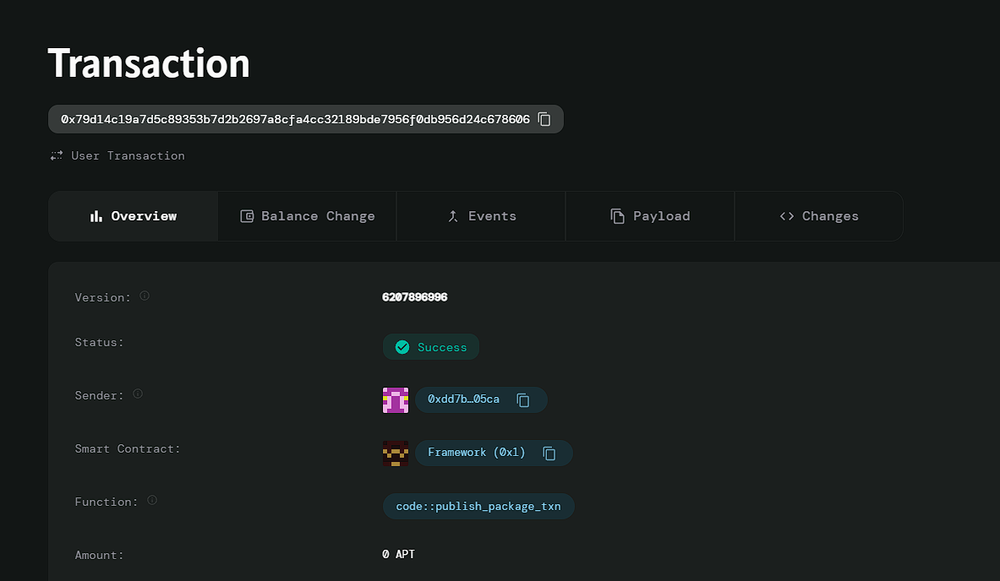

# Decentralized File Storage

# Deployed ID: 0x79d14c19a7d5c89353b7d2b2697a8cfa4cc32189bde7956f0db956d24c678606

## Project Description
A smart contract that utilizes decentralized storage protocols like IPFS to store and manage files securely. Users can upload documents, images, or data, and the contract ensures that access permissions and file integrity are maintained, providing a tamper-proof way to handle sensitive information.

## Project Vision
The vision of Decentralized File Storage is to create a secure, user-friendly platform for storing and sharing files in a decentralized manner. By leveraging blockchain technology, we aim to empower users with full control over their data and ensure that access is only granted to authorized individuals.

## Key Features
- **Secure File Uploads:** Users can securely upload files to the decentralized storage.
- **Access Control:** Owners can grant specific access permissions to other users.
- **Tamper-Proof Storage:** The use of blockchain ensures that files remain immutable and secure.
- **Decentralized Architecture:** By utilizing IPFS, the system ensures high availability and redundancy.
